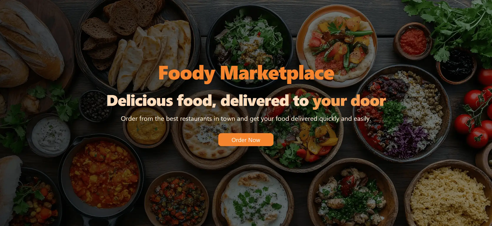
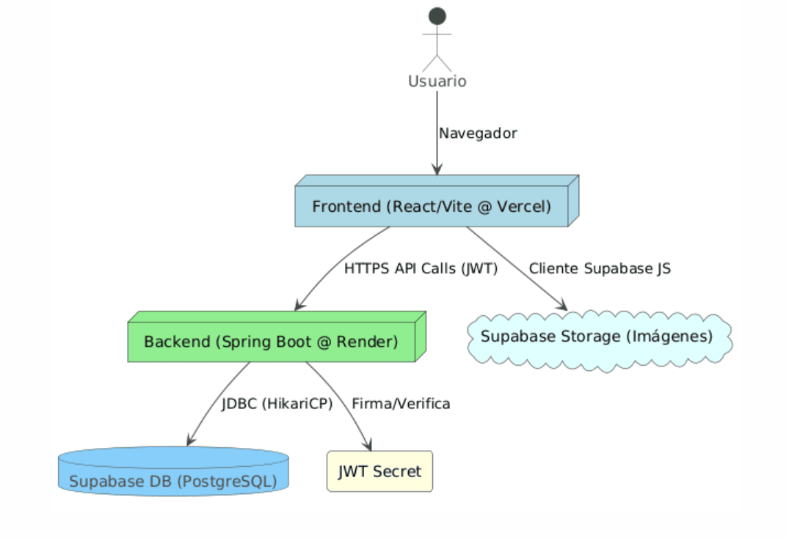
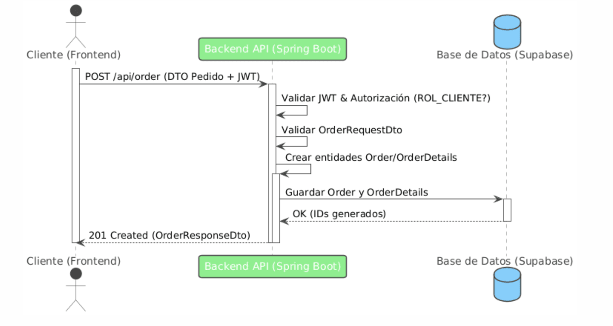
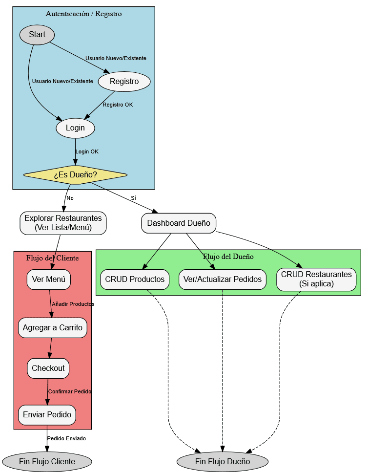
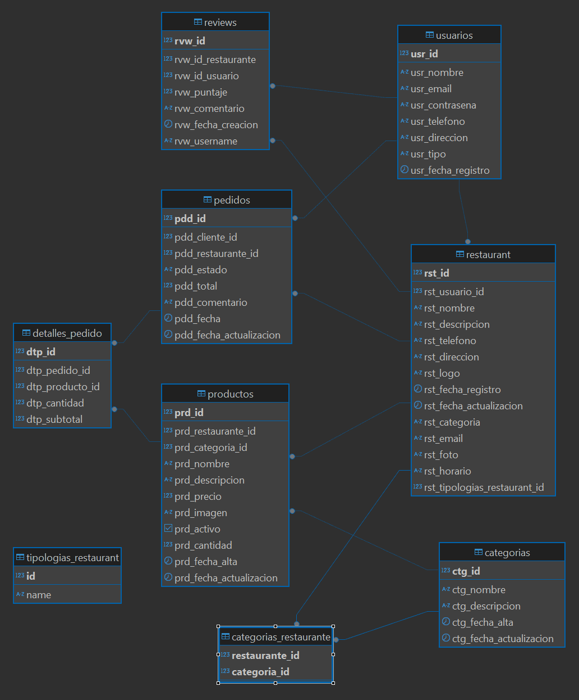

# 🍽️ Foody - Marketplace de Restaurantes: Del Restaurante a tu Mesa 🍕



[](https://foodymarket.vercel.app)

[](https://foodymarket.onrender.com/api/public/hello) 

[](https://opensource.org/licenses/MIT)

**Foody** es una plataforma web completa que simula un marketplace de comida online, conectando a clientes con restaurantes locales. Permite a los usuarios explorar una variedad de restaurantes, navegar por sus menús digitales, realizar pedidos personalizados y seguir su estado. Por otro lado, ofrece un panel dedicado para que los dueños de restaurantes gestionen eficientemente sus establecimientos, productos (platos, bebidas) y los pedidos entrantes.

Este proyecto es una demostración de habilidades Full Stack, integrando un backend robusto con Java/Spring Boot y un frontend moderno con React/TypeScript.

## 🚀 Demo en Vivo

* **Frontend:** [https://foodymarket.vercel.app](https://foodymarket.vercel.app) 
* **Backend API:** `https://foodymarket.onrender.com/api` 

**Credenciales de Prueba:**

* **Cliente:** `usuario1@example.com` / `password1` 

* **Restaurante:** `dueno1@example.com` / `password3` 

* **Nota:** El despliegue utiliza los planes gratuitos de Vercel y Render. El backend puede experimentar un **arranque en frío** (cold start) si no ha recibido tráfico recientemente, tardando 1-2 minutos en la primera respuesta. ¡Ten paciencia!*

## ✨ Características Principales

* **Para Clientes:**
    * Registro e Inicio de Sesión (Autenticación basada en JWT).
    * Exploración de Restaurantes (con filtro básico por tipo de restaurante).
    * Visualización detallada de Menús por Restaurante.
    * Carrito de Compra interactivo.
    * Proceso de Pedido simplificado.
    * Historial de Pedidos del cliente.
    * Gestión de Perfil de Usuario.
* **Para Dueños de Restaurante:**
    * Registro e Inicio de Sesión.
    * Panel de Administración (Dashboard).
    * Gestión CRUD completa de Productos.
    * Asociación de Productos a Categorías.
    * Visualización y Gestión de Pedidos recibidos en sus restaurantes (cambiar estado).
    * Gestión del Perfil del Restaurante.
* **Generales:**
    * API RESTful documentada (implícitamente con SpringDoc/Swagger).
    * Seguridad basada en Roles (CLIENTE, RESTAURANTE).
    * Arquitectura Monorepo gestionada con Git Subtree.
## 🛠️ Stack Tecnológico

Este proyecto combina tecnologías modernas para frontend y backend:

* **Backend:**
    * **Java 21:** Última versión LTS.
    * **Spring Boot 3.x:** Framework principal para desarrollo rápido de APIs REST.
    * **Spring Security 6.x:** Gestión de autenticación (JWT) y autorización basada en roles.
    * **Spring Data JPA & Hibernate:** ORM para la persistencia de datos y interacción con la base de datos.
    * **PostgreSQL (v15.8 en Supabase):** Base de datos relacional elegida por su robustez y características.
    * **Lombok:** Reducción de código boilerplate en entidades y DTOs.
    * **Maven:** Gestor de dependencias y construcción.
    * **JWT (jjwt library):** Implementación de JSON Web Tokens para sesiones stateless.

* **Frontend:**
    * **TypeScript:** Superset de JavaScript para tipado estático y mejor escalabilidad.
    * **React:** Librería principal para construir interfaces de usuario interactivas.
    * **Vite:** Herramienta de build moderna y rápida para desarrollo frontend.
    * **Tailwind CSS:** Framework CSS utility-first para diseño rápido y consistente.
    * **Shadcn UI:** Librería de componentes UI basada en Radix UI y Tailwind.
    * **Axios / Fetch:** Para realizar llamadas a la API backend.
    * **React Query** Para gestión de estado y caching de datos.
    * **Decimal.js:** Librería para manejo preciso de cálculos monetarios.

* **Base de Datos:**
    * **Supabase (PostgreSQL):** Plataforma BaaS usada para alojar la base de datos PostgreSQL.
    * **Supabase Storage (Opcional):** Usado para almacenamiento de imágenes (logos, productos, etc.).

* **Despliegue:**
    * **Backend:** Render (Plan Hobby).
    * **Frontend:** Vercel (Plan Hobby) 
    * **Docker & Docker Compose:** Configuración disponible para entorno local contenerizado.
## 🏗️ Arquitectura y Flujo

### Arquitectura



### Flujo de pedido





### Diagrama de base de datos




## 🚀 Uso de la Aplicación

Una vez que la aplicación está corriendo localmente o desplegada, puedes interactuar con ella a través de dos flujos principales:

### Flujo del Cliente

1.  **Registro:** Accede a la página de registro y crea una cuenta proporcionando nombre, email, contraseña, rol ("cliente"), teléfono y dirección. Tras el registro exitoso, iniciarás sesión automáticamente.
2.  **Inicio de Sesión:** Si ya tienes cuenta, inicia sesión con tu email y contraseña. Recibirás un token JWT que se usará para autenticar las siguientes peticiones. Puedes usar una de las ya existentes.
3.  **Explorar Restaurantes:** Navega por la lista de restaurantes disponibles. Puedes ver información básica de cada uno.
4.  **Ver Menú:** Selecciona un restaurante para ver su menú detallado, con productos agrupados por categorías.
5.  **Añadir al Carrito:** Añade los productos deseados al carrito de compra, especificando la cantidad. El subtotal se calcula automáticamente.
6.  **Realizar Pedido:** Ve al carrito, revisa los productos, añade comentarios si es necesario y confirma el pedido.
7.  **Confirmación y Seguimiento:** Recibirás una confirmación (estado inicial "pendiente"). Podrás consultar tu historial de pedidos para ver el estado actualizado (pendiente, pagado, entregado, cancelado).
8.  **(Opcional) Gestionar Perfil:** Actualiza tu información de contacto (nombre, teléfono, dirección).

### Flujo del Dueño de Restaurante

1.  **Registro/Inicio de Sesión:** El proceso es similar al del cliente, pero seleccionando el rol "restaurante".
2.  **Panel de Administración (Dashboard):** Accede al panel principal donde verás un resumen de tus restaurantes y pedidos recientes.
3.  **(Opcional) Gestionar Restaurantes:** Si la lógica lo permite, podrías añadir/editar los datos de tus restaurantes asociados (nombre, dirección, horarios, logo, etc.).
4.  **Gestionar Categorías:** Crea nuevas categorías globales de productos si es necesario.
5.  **Gestionar Productos:** Añade nuevos productos a tu menú (indicando nombre, descripción, precio, categoría, imagen, stock/cantidad inicial), edita los existentes o márcalos como inactivos/activos.
6.  **Gestionar Pedidos:** Visualiza los pedidos entrantes para tus restaurantes. Cambia el estado de los pedidos (ej: de "pendiente" a "pagado", "en preparación", "entregado", o "cancelado").

## 🚀 Getting Started (Configuración Local)

Sigue estos pasos para levantar el entorno de desarrollo en tu máquina.

### Prerrequisitos

* **Java 21** (o la versión especificada en tu `pom.xml`).
* **Maven 3.9+** (o usa el Maven Wrapper `./mvnw` incluido).
* **Node.js v18+** y **npm** (o `yarn`/`pnpm`).
* **PostgreSQL:** Una instancia corriendo localmente o acceso a una remota (ej: Supabase) para desarrollo. Necesitarás crear una base de datos (ej: `foody_db_dev`).
* **(Opcional) Docker:** y Docker Compose.

### Pasos

1.  **Clonar el Repositorio:**
    ```bash
    git clone [https://github.com/Juan-Fuente-T/foodymarket.git](https://github.com/Juan-Fuente-T/foodymarket.git)
    cd foodymarket
    ```

2.  **Configurar Backend (`backend/`):**
    * **Variables de Entorno/Properties:** Configura la conexión a tu BD local/desarrollo y el secreto JWT. Define las siguientes variables de entorno en tu sistema o en la configuración de ejecución de tu IDE:
        * `SPRING_DATASOURCE_URL`: URL JDBC completa (ej: `jdbc:postgresql://localhost:5432/foody_db_dev` 
        * `SPRING_DATASOURCE_USERNAME`: Tu usuario de Postgres.
        * `SPRING_DATASOURCE_PASSWORD`: Tu contraseña de Postgres.
        * `JWT_SECRET`: Tu clave secreta larga para JWT.
    * **Construir con Maven (Opcional):**
        ```bash
        # Desde la carpeta raíz 'foodymarket'
        ./mvnw -f backend/pom.xml clean install -DskipTests
        ```
    * **Ejecutar Backend:** Desde tu IDE (clase `RestaurantsApplication`) o terminal:
        ```bash
        # Desde la carpeta raíz 'foodymarket'
        ./mvnw -f backend/pom.xml spring-boot:run
        ```
        El backend arrancará en `http://localhost:8080`.

3.  **Configurar Frontend (`frontend/`):**
    * **Variables de Entorno:** Crea un archivo `.env` en `frontend/` si no existe:
        ```dotenv
        # Archivo: frontend/.env
        VITE_API_BASE_URL=http://localhost:8080/api
        VITE_SUPABASE_URL=URL_PUBLICA_SUPABASE_DEV # Reemplaza
        VITE_SUPABASE_ANON_KEY=KEY_ANON_SUPABASE_DEV # Reemplaza
        ```
    * **Instalar Dependencias:**
        ```bash
        # Desde la carpeta raíz 'foodymarket'
        cd frontend
        npm install # o yarn install / pnpm install
        ```
    * **Ejecutar Frontend:**
        ```bash
        # Estando dentro de la carpeta 'frontend'
        npm run dev # o yarn dev / pnpm dev
        ```
        El frontend arrancará en `http://localhost:8081` (o el puerto de Vite).

4.  **Acceder:** Abre `http://localhost:8081` en tu navegador.

## 🤔 Retos y Aprendizajes

Durante el desarrollo de este proyecto, me enfrenté a varios desafíos técnicos significativos, cuya resolución contribuyó enormemente a mi aprendizaje:

* **Errores Intermitentes de Base de Datos (JDBC/PostgreSQL):** Se experimentaron problemas persistentes y difíciles de diagnosticar (`prepared statement exists`, `transaction aborted`, `unable to commit`) relacionados con la interacción entre el driver JDBC, Hibernate y el pool de conexiones, especialmente en entornos desplegados (Railway). La investigación involucró análisis de logs detallados, ajuste fino de parámetros del pool (HikariCP), experimentación con diferentes pools y la aplicación final del parámetro `prepareThreshold=0` en la URL JDBC como workaround para lograr estabilidad.
* **Optimización de Consultas (N+1):** Se identificaron y solucionaron múltiples problemas de N+1 consultas mediante el uso estratégico de `JOIN FETCH` en JPQL y `@EntityGraph` en Spring Data JPA, mejorando significativamente el rendimiento en la carga de datos relacionados (Pedidos con Detalles/Productos, Restaurantes con Cocina/Usuario).
* **Gestión de Monorepo con Git:** Se integraron los repositorios de backend y frontend en una estructura monorepo utilizando `git subtree add`, conservando el historial de commits de ambos proyectos para mantener la trazabilidad del desarrollo (visible principalmente en el historial general de la rama y localmente).
* **Manejo de Tipos Monetarios:** Se refactorizó el manejo de precios y totales tanto en el backend (migrando de tipos incorrectos a `BigDecimal` y `NUMERIC`) como en el frontend (usando `string` y la librería `Decimal.js` para cálculos) para garantizar la precisión decimal y evitar errores de redondeo.
* **Configuración de Despliegue y CORS:** Se configuró el despliegue del backend en Railway y del frontend en Vercel, ajustando variables de entorno (locales vs. producción con `VITE_`) y políticas CORS para permitir la comunicación entre ambos servicios. Se gestionaron las limitaciones de los planes gratuitos (ej: cold starts).
* **Seguridad con Spring Security y JWT:** Se implementó un sistema de autenticación stateless basado en JWT, con registro de usuarios, login y autorización basada en roles (CLIENTE, RESTAURANTE), asegurando endpoints y gestionando el contexto de seguridad.

## 🤝 Contribuciones

Las contribuciones son bienvenidas. Por favor, sigue los pasos estándar de fork y pull request.

## 📜 Licencia

Distribuido bajo la Licencia MIT. Ver `LICENSE` para más información.
    
